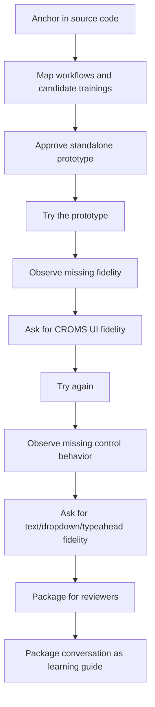

# How To Recreate This AI Collaboration

Generated: May 6, 2026

This guide explains how the DSMB guided training prototype was created through conversation. It is meant for someone who wants to learn how to lead an AI assistant through the same kind of work: source-code discovery, workflow mapping, prototype creation, fidelity review, iteration, and packaging for reviewers.

## What The User Did Well

The user did not start by asking for code. The user guided the assistant through a series of increasingly concrete decisions:

1. Anchor the work in the real source code.
2. Narrow the focus to one module.
3. Ask for workflow ideas before implementation.
4. Approve a standalone build instead of over-integrating too early.
5. Try the result.
6. Observe what felt wrong.
7. Give concrete fidelity feedback.
8. Ask for packaging and reviewer instructions.
9. Ask to package the conversation as a reusable learning artifact.

That sequence matters. It lets the assistant discover, propose, build, respond to critique, and package the result without losing sight of the real application.

## Conversation Pattern



## The Moves, In Order

| Move | What the user asked or observed | What the assistant provided | Why it worked |
| --- | --- | --- | --- |
| 1. Source-code anchoring | “Take a look at the CROMS_SOURCE source code... focus on the DSMB module specifically.” | The assistant inspected DSMB source areas and used that as the grounding for workflow ideas. | This prevented generic training ideas and kept the work tied to CROMS structure. |
| 2. Workflow ideation | “Develop a bunch of potential workflows... and potential micro-trainings...” | A workflow and micro-training catalog. | The user asked for thinking before building, which made the implementation easier to scope. |
| 3. Build authorization | “Great, let's build these.” | A standalone static prototype. | The user moved from planning to implementation with clear permission. |
| 4. Scope control | “I'm not worried about wiring this into the larger program... build these trainings separately for now...” | The assistant stopped treating integration as the priority and built a separate prototype. | This reduced risk and made the artifact shareable earlier. |
| 5. Usage request | “Alright I want to use it.” | The assistant opened and verified the prototype. | This shifted from code completion to actual usability. |
| 6. Visual fidelity critique | “This doesn't look like the CROMS user interface... make sure it matches this nearly exactly...” | The assistant copied real CROMS fonts/assets and rebuilt the training stage with CROMS-like headers, breadcrumbs, tables, panels, modals, and buttons. | The critique named the missing quality: transferability to the real UI. |
| 7. Interaction fidelity critique | “If it's a free text I need the person to simulate entering free text... if it is a drop down... show the drop down...” | The assistant added typed text fields, dropdown option menus, typeahead results, radio choices, textareas, and selected states. | The user clarified that fidelity includes behavior, not just appearance. |
| 8. Sharing question | “How can I share this with other people if it is not on a website?” | The assistant explained zip sharing and static hosting options. | This addressed the real-world review path, not just local development. |
| 9. Packaging request | “Create the zip files and provide the instructions...” | The assistant created zip packages and `OPEN_ME_FIRST.txt`. | The user asked for a deliverable people could actually use. |
| 10. Meta-learning request | “Package up our conversations... I want someone to learn how to do what I did here.” | The assistant created conversation context and this learning guide. | This turns the process into a repeatable method. |

## The Core Skill: Prompt, Inspect, Correct

The user’s strongest pattern was not writing perfect prompts. It was using a loop:

1. Ask for a grounded first pass.
2. Let the assistant produce something concrete.
3. Inspect the artifact as a real user would.
4. Identify the gap in plain language.
5. Ask for a more specific correction.
6. Repeat until the artifact can be used by others.

This is how the work improved from a generic prototype into a CROMS-like, control-aware guided training.

## Reusable Prompt Templates

### 1. Anchor The Assistant In The Real System

```text
Take a look at the [SOURCE OR FOLDER] source code. I want you to focus specifically on the [MODULE] module. First, understand the screens, routes, roles, and workflows before proposing anything.
```

### 2. Ask For Workflow Discovery Before Building

```text
Develop a set of potential workflows we could map for this module. For each workflow, propose micro-trainings where a user is guided to do a real task. Base the ideas on the source code and existing UI patterns.
```

### 3. Separate Prototype From Integration

```text
I am not worried about wiring this into the larger application yet. Build the trainings separately for now so we can review the experience and wire it in later.
```

### 4. Ask To Use The Artifact

```text
I want to use it now. Open it or tell me exactly how to run it locally.
```

### 5. Give Visual Fidelity Feedback

```text
This does not look enough like the real application. Make it match the real UI closely so reviewers understand that the training transfers to the actual system.
```

### 6. Give Interaction Fidelity Feedback

```text
The interaction fidelity is missing. If the real UI uses free text, the learner should type text. If it uses a dropdown, show the dropdown options and require the correct selection. If it uses typeahead, show search results and let the learner select one.
```

### 7. Ask For Shareable Packaging

```text
Package this so I can share it with reviewers who do not have the development environment. Include instructions for opening it on their computer.
```

### 8. Ask For A Learning Artifact

```text
Review our conversation and turn it into a guide that teaches someone how to lead this kind of AI-assisted workflow: what I asked, what you provided, what I observed, how I prompted corrections, and what changed.
```

## How To Review The Assistant’s Output

When the assistant gives you a prototype, review it in four layers.

### 1. Does It Reflect The Real Workflow?

Ask:

- Does the flow match how a real user would do the task?
- Are the steps in the right order?
- Are important roles, panels, dashboards, or modals missing?
- Are success states clear?

### 2. Does It Look Like The Real UI?

Ask:

- Does the header match?
- Do buttons, tables, panels, modals, and status labels feel familiar?
- Are real assets or reference images needed?
- Would a reviewer believe this maps to the real application?

### 3. Does It Behave Like The Real UI?

Ask:

- Are text fields actually typed into?
- Do dropdowns show options?
- Do typeaheads show search results?
- Do radio buttons, checkboxes, uploads, and comments behave distinctly?
- Is the correct target highlighted?

### 4. Can Someone Else Use It?

Ask:

- Is there an `index.html` or obvious start point?
- Are instructions included?
- Are all assets packaged?
- Has the zip been tested?
- Does the reviewer need login, internet, or local setup?

## What The Assistant Did At Each Stage

### After Source-Code Anchoring

The assistant inspected the DSMB source and translated it into workflow families:

- Oversight entity setup
- Study association
- Member and stakeholder management
- Meetings and agendas
- Documents and review workflows
- Conflict of Interest
- Member approval
- ISM/SO written review

### After Build Authorization

The assistant built a standalone static prototype:

- `index.html`
- `styles.css`
- `app.js`
- `data/trainings.js`
- local assets
- local instructions

It used stable target IDs so the prototype could later be mapped to real CROMS UI elements.

### After Visual Fidelity Feedback

The assistant moved from generic styling to CROMS-style rendering:

- Source Sans Pro font
- NIA/CROMS header
- Breadcrumb strip
- CROMS dashboard tile images
- List tables
- CROMS-style buttons
- Collapsible panels
- Modals
- Status pills

### After Interaction Fidelity Feedback

The assistant moved from “click the highlighted thing” to control-specific simulation:

- Text input requires typing.
- Dropdowns show menus.
- Typeahead controls show candidate results.
- Radio choices require selecting the answer.
- Textareas accept typed comments.
- Coachmarks describe the real action.

### After Packaging Requests

The assistant created:

- Prototype zip
- Review bundle zip
- Opening instructions
- Conversation context
- Learning guide

## Why The User’s Feedback Was Effective

The feedback was effective because it named the gap and the reason the gap mattered.

Less effective:

```text
Make it better.
```

More effective:

```text
This doesn't look like the CROMS user interface. Make sure it matches this nearly exactly because people need to understand transferability.
```

Less effective:

```text
The forms are wrong.
```

More effective:

```text
If it's free text, the person needs to simulate entering free text. If it is a dropdown, show the dropdown, the options, and have them select the correct one.
```

The stronger prompts named:

- The observed problem.
- The expected behavior.
- The reason it mattered.
- The next direction for the assistant.

## A Mini-Training For Someone Learning This Method

### Training Title

Lead An AI Assistant From Source Code To Shareable Prototype

### Learner

Product owner, analyst, trainer, UX lead, instructional designer, or technical program lead.

### Goal

The learner can guide an AI assistant to inspect a system, propose workflows, build a standalone prototype, critique fidelity, and package the result for reviewers.

### Steps

1. Choose one module.
2. Ask the assistant to inspect the source code for that module.
3. Ask for workflow families and micro-training ideas.
4. Select or approve a build direction.
5. Clarify whether the prototype should be standalone or integrated.
6. Ask to use the prototype.
7. Review it as a real user.
8. Give fidelity feedback tied to the real interface.
9. Give interaction feedback tied to real controls.
10. Ask for validation checks.
11. Ask for shareable packaging.
12. Ask for a learning record of the process.

### Completion Signal

The learner has:

- A runnable artifact.
- A workflow catalog.
- A package reviewers can open.
- A record explaining how the artifact was created.

## Checklist For Future Projects

- [ ] Did we anchor the assistant in the real source code?
- [ ] Did we focus on one module or workflow area?
- [ ] Did we ask for workflow mapping before implementation?
- [ ] Did we decide standalone vs integrated early?
- [ ] Did we use the prototype ourselves?
- [ ] Did we check visual fidelity?
- [ ] Did we check interaction fidelity?
- [ ] Did we ask for tests or validation?
- [ ] Did we package the artifact?
- [ ] Did we include reviewer instructions?
- [ ] Did we capture the conversation as a reusable learning artifact?

## Final Principle

The user’s role is not to know every technical implementation detail. The user’s role is to keep the work honest:

- honest to the source system,
- honest to the real user workflow,
- honest to the real interface,
- honest to how reviewers will open and judge the artifact.

That is what moved this project from “an AI made a prototype” to “we built a reviewable, teachable, transferable training artifact.”

